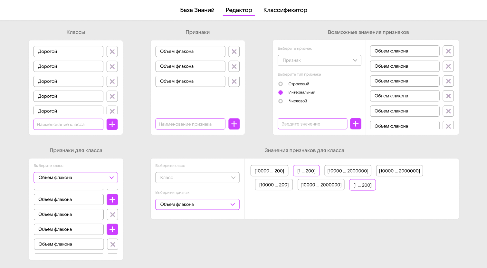
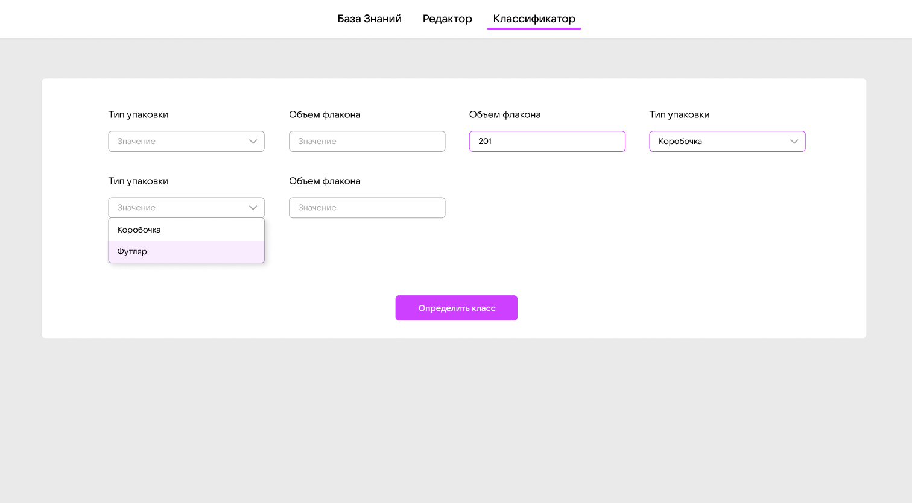
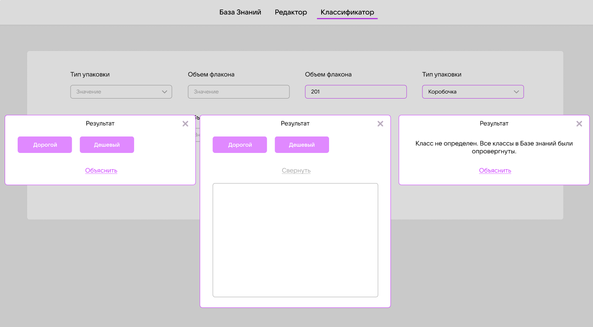

# Ontology-based classification system
It might help people to classify in different applied fields where ml-solution is expencive or unavalaible. This system has explanaition subsystem as an advantage vs ml-model. It don't pretent to be the great idea, is just a try to formalize classification task.

## Editor
[]()
## Knowledge base
[]()
## Classifier
[]()
## Reports
[]()

# How to
## Backend setup
```
python app.py runserver
```
## Frontend setup
```
npm install
```
### Compiles and hot-reloads for development
```
npm run serve
```
### Compiles and minifies for production
```
npm run build
```
### Customize configuration
See [Configuration Reference](https://cli.vuejs.org/config/).

